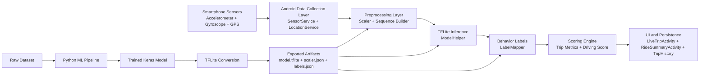

# TeleDrive

TeleDrive is an **AI-powered driving behavior analysis system** for Android devices.  
The project combines **real-time smartphone sensor processing** with an **on-device TensorFlow Lite model** to classify driving behavior and generate actionable trip analytics.

The system runs **entirely on-device**, making it **offline capable, privacy-friendly, and lightweight**.

---

# Project Overview

TeleDrive analyzes driving style from mobile sensor streams in **near-real-time**.  
The Android application collects motion and location data, transforms sensor values using exported ML artifacts, and performs inference on sequence windows of shape:

```
(50 × 8)
```

The system detects key driving patterns:

- Harsh Acceleration
- Harsh Braking
- Instability
- Normal Driving

Predictions are used to compute a **trip-level driving score** and generate ride summaries and historical insights.

---

# Key Features

- Real-time sensor ingestion from accelerometer and gyroscope
- GPS-based trip tracking (distance, speed, duration)
- On-device TensorFlow Lite inference (fully offline capable)
- Event classification for driving behavior anomalies
- Driving score calculation per ride
- Trip history and ride analytics in Android UI
- End-to-end ML pipeline for training and model deployment

---

# Technology Stack

## Mobile Application
- Kotlin
- Android SDK
- Jetpack Components
- SensorManager
- Location Services

## Machine Learning
- Python
- TensorFlow / Keras
- TensorFlow Lite
- Scikit-learn
- NumPy
- Pandas

## Model Architecture
- 1D Convolutional Neural Network (1D CNN)

---

# System Architecture

TeleDrive is organized as a **two-part architecture**:

1. Android Application (Kotlin)
2. Machine Learning Pipeline (Python)



---

# Android Runtime Flow

1. `SensorService` and `LocationService` collect motion and GPS data.
2. Sensor values are normalized using exported **scaler parameters**.
3. Sliding windows of `(50 × 8)` are passed to the **TensorFlow Lite model**.
4. Predictions are mapped into human-readable classes using `LabelMapper`.
5. Results update the **driving score, trip metrics, and UI analytics**.

---

# Android App Components

Key runtime modules include:

### Core Services

- `SensorService`
- `LocationService`

### ML Components

- `ModelHelper`
- `Scaler`
- `LabelMapper`

### UI

- `LiveTripActivity`
- `RideSummaryActivity`
- `TripDetailsActivity`

### Data

- `TripHistory`
- `DataLogger`

Responsibilities include:

- Sensor and GPS data capture
- ML inference and event detection
- Driving score computation
- Ride analytics visualization

---

# Machine Learning Pipeline

The ML workflow is located inside:

```
ml-pipeline/
```

It produces Android-ready artifacts used by the mobile app.

## Pipeline Goals

- Clean raw sensor datasets
- Generate sliding-window time sequences
- Train a 1D CNN classifier
- Convert the trained model to TensorFlow Lite
- Export scaler and label mappings for Android

---

# Model Input Specification

The model expects a time-series tensor with shape:

```
(50 timesteps × 8 features)
```

Feature set:

1. accel_x
2. accel_y
3. accel_z
4. gyro_x
5. gyro_y
6. gyro_z
7. accel_magnitude
8. gyro_magnitude

Each window represents a short segment of driving behavior captured from smartphone sensors.

---

# ML Pipeline Scripts

Located in:

```
ml-pipeline/scripts/
```

| Script | Purpose |
|------|------|
| clean_data.py | Cleans raw sensor data |
| create_sequences.py | Generates sliding windows |
| train_model.py | Trains the CNN model |
| convert_to_tflite.py | Converts model to TensorFlow Lite |
| export_scaler.py | Exports scaler parameters |
| export_label.py | Exports class label mappings |
| pipeline.py | Executes full pipeline |

---

# Python Dependencies

Defined in:

```
ml-pipeline/requirements.txt
```

Libraries:

- numpy
- pandas
- scikit-learn
- tensorflow
- joblib

---

# Repository Structure

```
TeleDrive/
│
├ android-app/              # Android application
│  └ app/
│
├ ml-pipeline/
│  ├ data/
│  ├ models/
│  │  ├ artifacts/
│  │  ├ keras/
│  │  └ tflite/
│  ├ scripts/
│  └ requirements.txt
│
├ docs/
│  ├ diagrams/
│  └ screenshots/
│
├ .gitignore
├ LICENSE
└ README.md
```

---

# Running the ML Pipeline

From the repository root:

```
cd ml-pipeline
python -m venv .venv
```

Activate environment:

### Windows

```
.\.venv\Scripts\Activate.ps1
```

### macOS/Linux

```
source .venv/bin/activate
```

Install dependencies:

```
pip install -r requirements.txt
```

Run pipeline:

```
python scripts/pipeline.py
```

Expected outputs:

```
ml-pipeline/models/keras/model.keras
ml-pipeline/models/tflite/model.tflite
ml-pipeline/models/artifacts/scaler.json
ml-pipeline/models/artifacts/labels.json
```

---

# Android Integration

Place the generated artifacts in the Android project:

```
android-app/app/src/main/assets/
```

Required runtime files:

- model.tflite
- scaler.json
- labels.json

Ensure preprocessing in Android matches **training-time scaling**.

---

## Application Screenshots

### Start Screen


### Trip Score


### Driving Behaviour


### Analytics Dashboard


### Event Evidence Capture


# Future Improvements

- Driver-specific personalization
- Additional driving behavior detection
- Model confidence scoring
- Federated learning updates
- Data augmentation for rare driving events
- Cloud dashboard for fleet analytics
- CI/CD automation for ML pipeline

---

# Author

Sharan S

Interests:

- Mobile AI Systems
- Embedded Machine Learning
- Intelligent Transportation Systems

---

# License

This project is licensed under the **MIT License**.

See the `LICENSE` file for details.