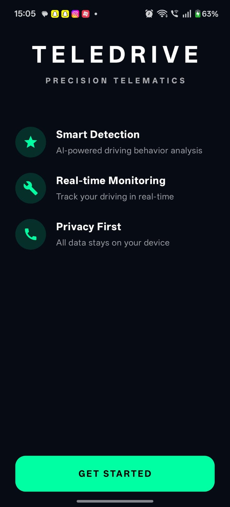
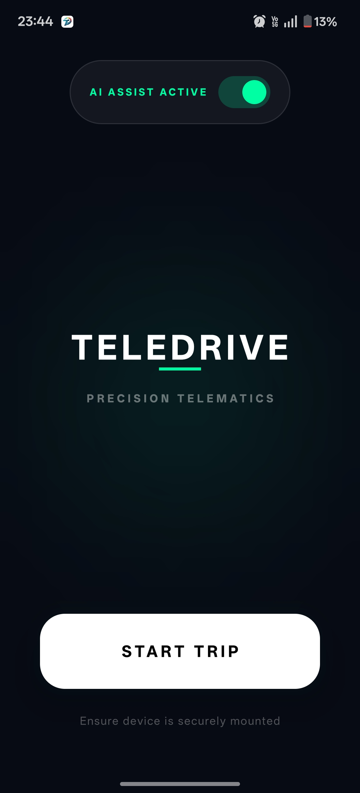
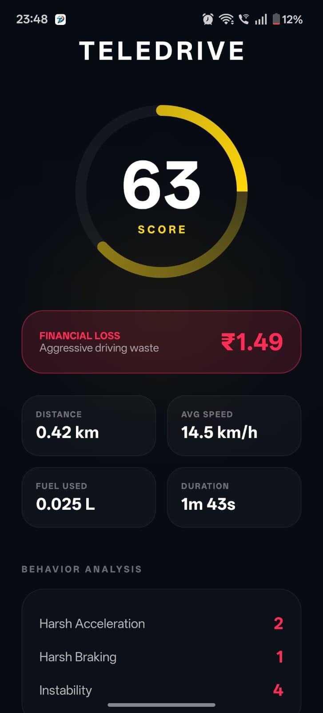
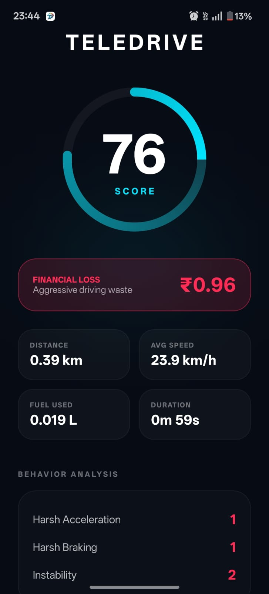
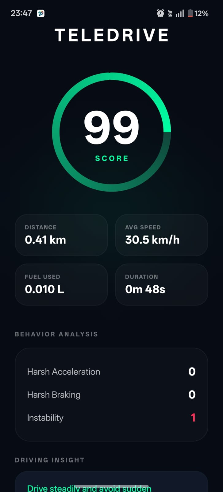
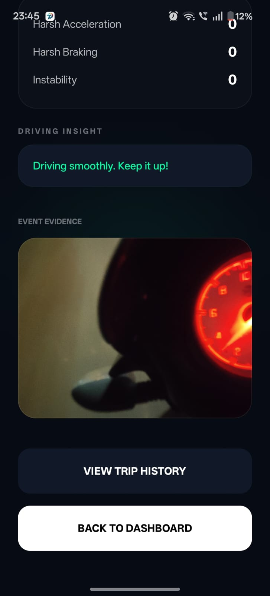
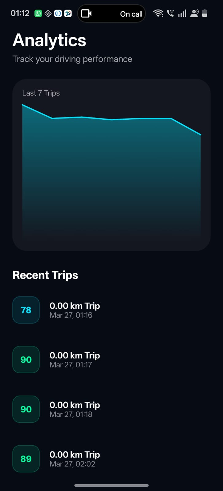
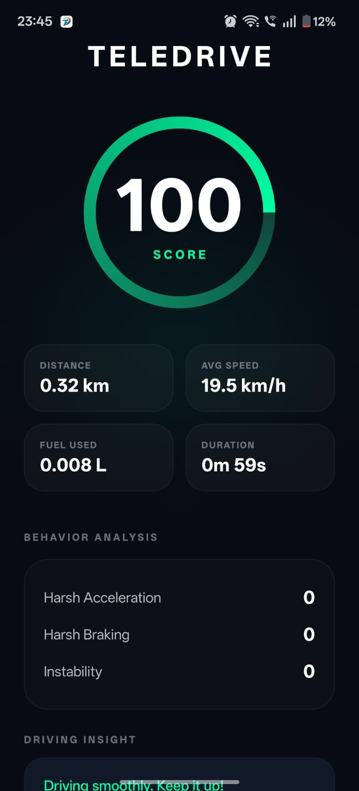

# TeleDrive 

> Edge-based riding behaviour analysis for Android — no cloud, no hardware, no subscription.

TeleDrive is a standalone Android app that detects harsh acceleration, harsh braking, and unstable riding in real-time using only your smartphone's built-in sensors. All inference runs on-device via a TensorFlow Lite 1D-CNN model. At the end of each trip, you get an eco score, fuel impact estimate, and a route-based event map.

Built for gig economy riders (Swiggy, Zomato, Zepto) and anyone who wants to understand and improve their riding behaviour — without paying for fleet telematics hardware.

---

# Demo

# Screenshots

| | | |
|:---:|:---:|:---:|
|  |  |  |
| **First Launch** | **Profile Setup** | **Start Trip** |
|  |  |  |
| **Live Monitoring** | **Ride Summary** | **Eco Score** |
|  |  |  |
| **Trip History** | **Event Evidence** | **Analytics** |
|  |  | |
| **Evidence Detail** | **Trip Score** | |

# Key Numbers

| Metric | Value |
|---|---|
| Training samples | 115,250 (class-balanced) |
| Raw readings collected | 473,800 |
| Real ride sessions | 48 |
| Offline accuracy (hold-out set) | 96.0% |
| Macro F1-score | 0.92 |
| Real-world validation accuracy | 98.76% |
| Sensor sampling rate | ~50 Hz |
| Min Android version | 8.0 (API 26) |
| Cloud dependency | None |

---

# Features

- **Real-time event detection** — Harsh Acceleration, Harsh Braking, Unstable Ride, Normal
- **Three detection modes** — Rule-Based, AI Assist (TFLite 1D-CNN), Hybrid (default)
- **Eco Score (0–100)** — diminishing-penalty model, updates live per event
- **Fuel & financial impact** — estimates wasted fuel and monetary loss per trip
- **Camera evidence** — automatically captures a timestamped rear-camera JPEG on confirmed events
- **Event Map** — interactive route map with hotspot detection and event markers
- **Trip history & analytics** — score trends, event breakdowns, aggregate stats
- **Fully offline** — sensing, inference, scoring, and storage all happen on-device

---

# Architecture

```
Accelerometer + Gyroscope + GPS (50 Hz)
        │
        ▼
SensorService (Android Foreground Service)
        │
        ▼
TeleDriveProcessor
  ├── Gravity removal (complementary filter, α = 0.95)
  ├── Spike rejection (magnitude > 12g filtered)
  ├── Median filter (window = 5)
  └── Moving average (window = 8)
        │
        ▼
FeatureVector (6 features per 1-second window)
  ├── meanForwardAccel
  ├── peakForwardAccel
  ├── minForwardAccel
  ├── stdAccel
  ├── meanGyro
  └── peakGyro
        │
        ▼
AnalyzerProvider
  ├── RuleBasedAnalyzer  — speed-adaptive thresholds
  ├── MLAnalyzer         — TFLite 1D-CNN inference
  └── Hybrid             — rule + ML combined (default)
        │
        ▼
EventDetector
  ├── Speed gate (< 15 km/h → NORMAL)
  ├── Cooldown logic (1500ms)
  ├── Sustained detection buffer (5-sample window)
  └── Confirmed DrivingEvent
        │
        ├──▶ EcoScoreEngine → live score update
        ├──▶ CameraControllerActivity → evidence JPEG
        └──▶ LiveDataBus → UI update (LiveTripActivity)
        │
        ▼
RideSessionManager → TripStorage (SharedPreferences)
```

---

# Model

| Property | Value |
|---|---|
| Architecture | 1D Convolutional Neural Network |
| Framework | TensorFlow Lite (on-device) |
| Input | 6-feature vector per 1-second window |
| Output classes | NORMAL, HARSH_ACCELERATION, HARSH_BRAKING, UNSTABLE_RIDE |
| Training data source | 48 real two-wheeler ride sessions |
| Inference latency | < 10ms on mid-range Android |

The hybrid mode combines CNN confidence scores with rule-based thresholds, using the CNN output to override rule decisions when confidence is high — reducing false positives from road bumps and traffic stops.

---

# Tech Stack

| Layer | Technology |
|---|---|
| Language | Kotlin |
| UI | Jetpack Compose |
| ML Inference | TensorFlow Lite |
| Camera | CameraX |
| Location | FusedLocationProviderClient |
| Storage | SharedPreferences |
| Background processing | Android Foreground Service |
| Build system | Gradle (Kotlin DSL) |

---

# Module Overview

```
com/teledrive/app/
├── analysis/
│   ├── AnalyzerProvider.kt      # Switches between rule/ML/hybrid
│   ├── DrivingAnalyzer.kt       # Interface
│   ├── MLAnalyzer.kt            # TFLite CNN inference
│   └── RuleBasedAnalyzer.kt     # Speed-adaptive rule engine
├── camera/
│   └── CameraControllerActivity.kt  # Evidence capture
├── core/
│   ├── EcoScoreEngine.kt        # Diminishing-penalty scoring
│   ├── EventDetector.kt         # Sustained detection + cooldown
│   ├── FuelEstimator.kt         # Mileage & fuel impact
│   ├── LiveDataBus.kt           # Service → UI event bus
│   ├── Models.kt                # Data classes & enums
│   ├── RideSession.kt           # Session state management
│   └── TeleDriveProcessor.kt   # Signal processing & feature extraction
├── ml/
│   ├── DataLogger.kt            # Training data collection
│   └── MLModelRunner.kt        # TFLite runner
├── services/
│   ├── LocationService.kt       # GPS tracking
│   └── SensorService.kt         # IMU data acquisition
├── TripHistory/
│   ├── TripStorage.kt           # Persistence layer
│   └── TripSummary.kt           # Trip data model
├── LiveTripActivity.kt          # Real-time monitoring UI
├── MainActivity.kt              # Dashboard
└── RideSummaryActivity.kt       # Post-trip summary
```

---

# Getting Started

# Requirements

- Android Studio Hedgehog or later
- Android device running API 26+ (Android 8.0)
- Permissions: Accelerometer, Gyroscope, GPS, Camera, Foreground Service

# Build & Run

```bash
git clone https://github.com/sharansergio-creator/TeleDrive.git
cd TeleDrive
```

Open in Android Studio → sync Gradle → run on a physical device.

> Physical device required. The emulator does not produce real sensor data. Detection accuracy depends on actual IMU hardware.

# First Use

1. Grant all requested permissions on first launch
2. Set up your vehicle profile (used for fuel estimation)
3. Mount your phone securely on the bike (handlebar mount recommended)
4. Tap **Start Trip** — the app runs as a Foreground Service in the background
5. Ride normally — events are detected and scored in real-time
6. Tap **Stop Trip** to view your summary, eco score, and event map

---

# Detection Modes

| Mode | How it works |
|---|---|
| **Rule-Based** | Speed-adaptive thresholds on peak/min acceleration and gyroscope magnitude |
| **AI Assist** | TFLite 1D-CNN classifies each 1-second feature window |
| **Hybrid** _(default)_ | CNN output gates rule-based decisions; reduces false positives from road noise |

---

# Eco Score

Score starts at 100 and decreases with each confirmed event:

| Event | Penalty formula |
|---|---|
| Harsh Acceleration | `(severity/5) × 0.6 × 10` |
| Harsh Braking | `(severity/5) × 1.0 × 10` |
| Unstable Ride | `(severity/5) × 0.7 × 10` |

Braking is penalised more heavily than acceleration — consistent with fuel and wear research on two-wheelers.

---

# Limitations

- Single-rider validation (48 sessions, one device, Mangalore road conditions)
- No cross-device calibration — thresholds tuned for specific IMU hardware
- Camera evidence requires rear-facing mount for useful context
- GPS accuracy affects distance and fuel estimates on short trips

---

# Future Work

- Cross-device IMU calibration
- Cloud sync for fleet/family dashboards
- OBD-II integration for direct fuel readings
- iOS port
- ADAS-style forward collision warning using camera feed

---

# Context

Built as a final year BCA Data Science project at Srinivas University, Mangalore (2023–2027).  
Submitted to address the gap in affordable, hardware-free telematics for individual two-wheeler riders in India.

---

# Author

Sharan S — [github.com/sharansergio-creator](https://github.com/sharansergio-creator)

---

# License

MIT
